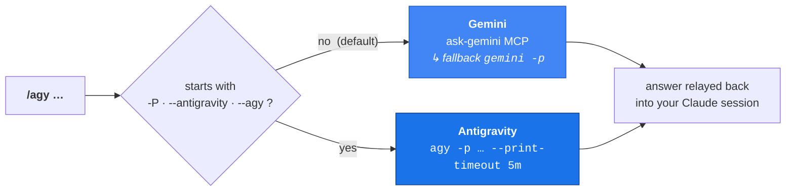

<div align="center">

# 🛰️ agy-consult

### A second opinion, one slash away.
Consult an external coding-model CLI **without leaving Claude Code** —
**Gemini** by default, **Google Antigravity** (`agy`) with `-P`.

<br/>


-1A73E8?logo=google&logoColor=white)


</div>

---

## ✨ Why

You're deep in a Claude Code session and want a **second model's take** —
a tricky algorithm, an unfamiliar stack trace, a quick design sanity-check.
`agy-consult` lets Claude ask **Gemini** or **Antigravity** inline, then keep
driving your work with the answer in hand. No tab-switching, no copy-paste.

```text
You ──▶ Claude Code ──▶ /agy "is this regex catastrophic?" ──▶ Gemini ──▶ answer ──▶ Claude keeps going
                          /agy -P "design a retry policy"  ──▶ Antigravity ──┘
```

## 🚦 How it routes



The leading flag (`-P`, `--antigravity`, or `--agy`) selects Antigravity and is
**stripped** before the prompt is sent. Everything else goes to Gemini.

## ⚡ Quick start

```bash
# Add the marketplace and install (public GitHub source)
claude plugin marketplace add AIgen-Solutions-s-r-l/agy-claude-plugin
claude plugin install agy-consult@aigen-cli-tools
```

<details>
<summary>…or from a local checkout</summary>

```bash
git clone https://github.com/AIgen-Solutions-s-r-l/agy-claude-plugin
claude plugin marketplace add ./agy-claude-plugin
claude plugin install agy-consult@aigen-cli-tools
```
</details>

> **Restart Claude Code** (or open a new session) for the `/agy` command to load.

## 🧑‍💻 Usage

| Command | Goes to | Notes |
|---|---|---|
| `/agy <question>` | **Gemini** | the default backend |
| `/agy @src/foo.py what does this do?` | **Gemini** | `@file` pulls the file in (ask-gemini syntax) |
| `/agy --model gemini-2.5-pro <q>` | **Gemini** | pin a specific model |
| `/agy -P <question>` | **Antigravity** | `--antigravity` / `--agy` work too |

The reply is prefixed with the backend that answered — **`Gemini:`** or
**`Antigravity (agy):`** — so you always know who's talking.

## 🔌 Requirements

| Backend | Needs |
|---|---|
| **Gemini** (default) | the `gemini-cli` MCP server (tool `mcp__gemini-cli__ask-gemini`), **or** the `gemini` CLI on your `PATH` |
| **Antigravity** (`-P`) | the `agy` CLI installed and signed in via the **Antigravity desktop app** |

> ⏳ **Heads-up on `agy`:** it's an *agentic* CLI — slow to start (tens of
> seconds) and authenticated through the desktop app. If it hangs or errors on
> auth, make sure you're signed in to Antigravity. The command already uses a
> generous `--print-timeout 5m`.

## 🛡️ Safety

The command **never** passes `--dangerously-skip-permissions` to `agy`. That
flag auto-approves every tool the model decides to run — unsafe, and blocked by
policy. For plain Q&A `agy` answers fine without it.

## 🗂️ Layout

```text
agy-claude-plugin/
├── .claude-plugin/
│   └── marketplace.json          # marketplace "aigen-cli-tools"
└── plugins/
    └── agy-consult/
        ├── .claude-plugin/
        │   └── plugin.json        # plugin manifest (v0.1.0)
        └── commands/
            └── agy.md             # the /agy slash command
```

## 🔄 Updating

```bash
claude plugin marketplace update aigen-cli-tools   # pull the latest manifest
claude plugin update agy-consult@aigen-cli-tools   # upgrade the installed plugin
```

## 🤝 Contributing

Issues and PRs welcome. The whole plugin is one markdown command file plus two
small JSON manifests — easy to fork, easy to extend with new backends.

## 📄 License

[MIT](./LICENSE) © 2026 AIgen Solutions S.r.l. — Alessio Rocchi

<div align="center"><sub>Built for <a href="https://claude.com/claude-code">Claude Code</a> · 🤖 Generated with Claude Code</sub></div>
