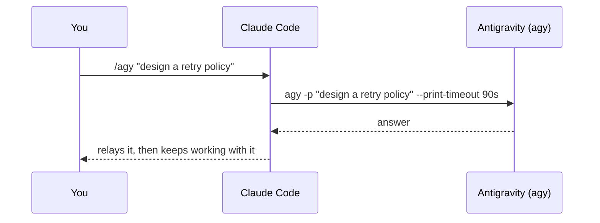

<div align="center">

# 🛰️ agy-consult

### A second opinion, four slashes away.
A four-command suite — `/agy`, `/agy-review`, `/agy-debug`, `/agy-panel` — that
consults **Gemini, Claude, and GPT-OSS** models through the **Antigravity**
(`agy`) CLI **without leaving Claude Code**. Ask, review a diff, debug a trace,
or poll a panel — answers come back inline so you keep working.

<br/>


-1A73E8?logo=google&logoColor=white)


</div>

---

## ✨ Why

You're deep in a Claude Code session and want a **second model's take** —
a tricky algorithm, an unfamiliar stack trace, a quick design sanity-check.
`agy-consult` lets Claude ask **Antigravity** inline, then keep driving your
work with the answer in hand. No tab-switching, no copy-paste.

One CLI, many vendors: `agy` fronts **Gemini, Claude, and GPT-OSS** models, so a
single `/agy` gives Claude a real second opinion from a different stable.

## 🔁 The flow



## ⚡ Quick start

```bash
# Add the marketplace and install (public GitHub source)
claude plugin marketplace add AIgen-Solutions-s-r-l/agy-claude-plugin
claude plugin install agy-consult@aigen-cli-tools
```

<details>
<summary>…or from a local checkout</summary>

```bash
git clone https://github.com/AIgen-Solutions-s-r-l/agy-claude-plugin
claude plugin marketplace add ./agy-claude-plugin
claude plugin install agy-consult@aigen-cli-tools
```
</details>

> **Restart Claude Code** (or open a new session) for the agy-consult commands to load.

## 🧑‍💻 Usage

| Command | What it does |
|---|---|
| `/agy <question>` | ask Antigravity, relay the answer (90s timeout) |
| `/agy --deep <question>` | same, with a longer 5m timeout for heavy agentic work |
| `/agy --model <name> <question>` | pin a specific model (`agy models` to list) |
| `/agy --add-dir <path> <question>` | give `agy` an extra context directory |
| `/agy -c <follow-up>` | continue the previous `agy` conversation (cwd-keyed, last-writer-wins; use `agy --conversation <ID>` for a deterministic resume) |
| `/agy-review [--deep] [focus]` | senior-reviewer review of your current diff (bounded, consented, `--sandbox`, 3m / 5m with `--deep`) |
| `/agy-debug [--deep] <error/trace> [file …]` | root-cause hypotheses + next checks from a pasted error and the named file(s) (bounded, consented, `--sandbox`, 3m / 5m with `--deep`) |
| `/agy-panel <question>` | ask the same question across several distinct models (Gemini / Claude / GPT-OSS) and compare answers side by side (names validated against `agy models`; one backend, so not failure-independent) |

The reply comes back prefixed with **`Antigravity (agy):`** so you always know
it's the external model talking, not Claude.

## 🔌 Requirements

- The **`agy` CLI** installed (`~/.local/bin/agy`) and signed in through the
  **Antigravity desktop app**.

> ⏳ **Heads-up on `agy`:** it's an *agentic* CLI — slow to start (tens of
> seconds) and authenticated via the desktop app. If it hangs or errors on auth,
> make sure you're signed in to Antigravity. The default `--print-timeout` is now
> **90s** (warm calls are ~5s); use `--deep` for the 5m timeout on heavy agentic
> work.

## 🔐 Privacy / governance

`agy` authenticates to **Google** and stores prompts **and** responses in
**cleartext locally** — any context you pass **leaves the machine**. The command
never auto-attaches secrets, `.env` files, or `.gitignored` files; only what you
knowingly choose to share is sent.

**IP / terms:** code attached to a consult is **transmitted to Google** under
the Antigravity terms — do **not** consult on code you are contractually barred
(NDA, license, or employer policy) from sharing with third-party AI.

## 🛡️ Safety

The command **never** passes `--dangerously-skip-permissions` to `agy`. That
flag auto-approves every tool the model decides to run — unsafe, and blocked by
policy. For plain Q&A `agy` answers fine without it. The command is also scoped
to `Bash(agy:*)` only — it can't reach any other tool.

## 🗂️ Layout

```text
agy-claude-plugin/
├── .claude-plugin/
│   └── marketplace.json          # marketplace "aigen-cli-tools"
├── CHANGELOG.md                  # release history (Keep a Changelog)
├── test/
│   ├── fixtures/leaky.txt        # tracked, FAKE planted secret
│   └── secret-scan.sh            # proves the secret scan catches it (CI)
└── plugins/
    └── agy-consult/
        ├── .claude-plugin/
        │   └── plugin.json        # plugin manifest (v0.4.0)
        └── commands/
            ├── agy.md             # /agy        — inline second opinion
            ├── agy-review.md      # /agy-review  — review the current diff
            ├── agy-debug.md       # /agy-debug   — root-cause a pasted error
            └── agy-panel.md       # /agy-panel   — cross-model comparison
```

## 🔄 Updating

```bash
claude plugin marketplace update aigen-cli-tools   # pull the latest manifest
claude plugin update agy-consult@aigen-cli-tools   # upgrade the installed plugin
```

## 🤝 Contributing

Issues and PRs welcome. The whole plugin is one markdown file per command, two
small JSON manifests, and a tiny shell test — easy to fork, easy to extend.

## 📄 License

[MIT](./LICENSE) © 2026 AIgen Solutions S.r.l. — Alessio Rocchi

<div align="center"><sub>Built for <a href="https://claude.com/claude-code">Claude Code</a> · 🤖 Generated with Claude Code</sub></div>
